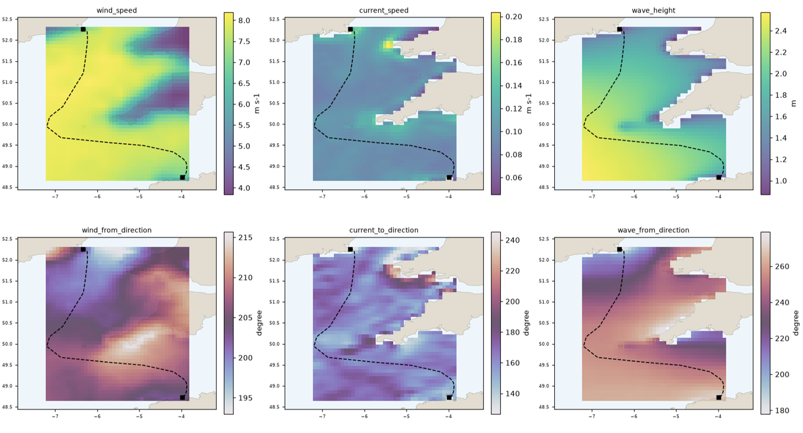

# water-routefinder

[](https://github.com/FraSanvit/water-routefinder/actions/workflows/ci.yml)
[](https://frasanvit.github.io/water-routefinder/)
[](https://codecov.io/gh/FraSanvit/water-routefinder)
[](https://results.pre-commit.ci/latest/github/FraSanvit/water-routefinder/main)
[](LICENSE)

Builds standardised wind, current and wave conditions along vessel routes — downloads met-ocean
data (Copernicus Marine and/or ERA5), harmonises it onto one grid, and samples it onto route
geometry into the ready-to-use bundle
[`water-path`](https://github.com/FraSanvit/water-path) consumes. A [Snakemake](https://snakemake.github.io/)
workflow, managed with [pixi](https://pixi.sh).

**📖 Full documentation: [frasanvit.github.io/water-routefinder](https://frasanvit.github.io/water-routefinder/)**
— quickstart, every `config/config.yaml` key, architecture, and the v0.2 bundle contract.

The workflow supports only `cmems` and `era5` for now (a later stage may add an offline mock
provider back for demos/CI) — running `run-demo` for real needs live credentials (see the
[Quickstart](https://frasanvit.github.io/water-routefinder/quickstart/)).




## Quickstart

```sh
pixi install                # creates the project environment (pixi.toml)
pixi run test-unit           # offline unit + input-format tests (no credentials needed)
pixi run dry-run              # sanity-check the DAG without running anything (no credentials needed)

cp .env.example .env         # then fill in CMEMS_USERNAME/CMEMS_PASSWORD (see the docs
                               #   for alternatives, incl. `copernicusmarine login`)
pixi run run-demo            # builds resources/user/dublin-bay -> results/dublin-bay/

pixi run run-network sherkin-island   # any other network under resources/user/ -- same config
pixi run run-all                      # or every network under resources/user/
```

There is one config, `config/config.yaml`, for every network: no config file per network, and it
doesn't name a network either. `run-network <name>[,<name>...]` only chooses *which* to build.

`run-demo` produces, from the example network under `resources/user/dublin-bay/`:

```text
results/dublin-bay/
  network/{harbours.csv, routes.geojson}      # the water-path bundle
  environment/{conditions.parquet, conditions.meta.yaml}
  validation.txt                              # "OK", or the contract violations found
  dublin-bay_diag_plot.png                    # route map (real coastlines) + conditions-over-time + data-quality panel
  dublin-bay_availability_map.png             # per-variable pixel map of the source grid's own coverage, route overlaid
```

See **[Configuring your own network](https://frasanvit.github.io/water-routefinder/quickstart/#build-your-own-network)**
for `routes.geojson`/`harbours.csv` shape and every `config/config.yaml` key.

## Layout

```text
pixi.toml, pyproject.toml   # pixi workspace + the water_routefinder package (hatchling)
mkdocs.yml, docs/            # the documentation site (published to GitHub Pages)
INTERFACE.yaml               # path-variable documentation
config/                      # user-editable config + its schema doc
workflow/                    # Snakefile, rules/*.smk, scripts/*.py, internal/ (schema + settings)
src/water_routefinder/       # the reusable, unit-tested core the workflow scripts call into
resources/user/              # your input networks (routes.geojson + harbours.csv)
resources/automatic/          # downloads + intermediates (safe to delete; regenerated)
resources/basemap/            # bundled offline land polygons for the diagnostic plot's map panel
results/                      # the built bundle(s) + validation report + diagnostic plot
tests/                        # unit, input-format, and end-to-end workflow tests
```

See [Architecture](https://frasanvit.github.io/water-routefinder/architecture/) for how it fits
together and [the bundle contract](https://frasanvit.github.io/water-routefinder/contract/) for
the exact output format.

## Tests

```sh
pixi run test-unit             # offline: unit tests + input-format tests
pixi run test                  # same, minus any @pytest.mark.integration test
pixi run test-cov               # same, + a coverage report (coverage.xml, for Codecov)
pixi run test-integration-live # needs CMEMS_USERNAME/CMEMS_PASSWORD and/or CDS API credentials
                                 #   -- includes the full end-to-end Snakemake workflow test
```

## Docs site

`docs/` (built with [MkDocs Material](https://squidfunk.github.io/mkdocs-material/)) is published
automatically to GitHub Pages on every push to `main` that touches it
(`.github/workflows/docs.yml`). To preview locally:

```sh
pixi run docs-serve   # http://127.0.0.1:8000, live-reloads on edit
pixi run docs-build    # static build to site/ (--strict: fails on broken links)
```

## Acknowledgements

This repo's directory/workflow conventions follow
[`modelblocks-org/data-module-template`](https://github.com/modelblocks-org/data-module-template)
and the Snakemake data-module practice of [irm-codebase](https://github.com/irm-codebase) — see
[Architecture](https://frasanvit.github.io/water-routefinder/architecture/) for the specifics.

## License

Apache-2.0 — see `LICENSE`.
